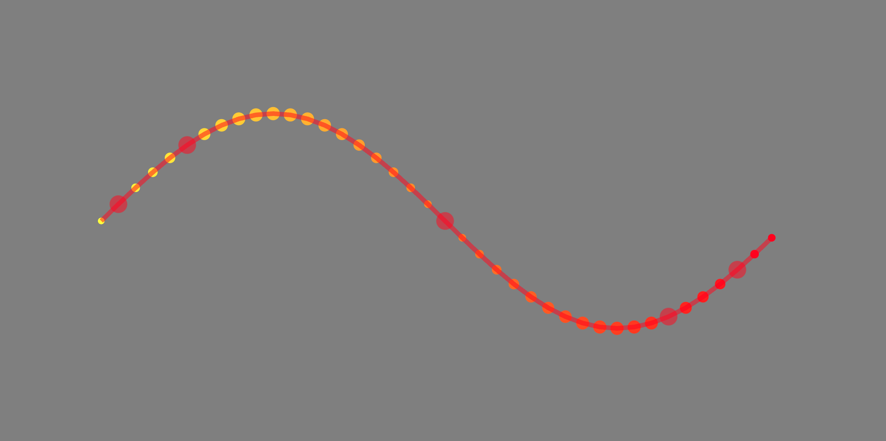
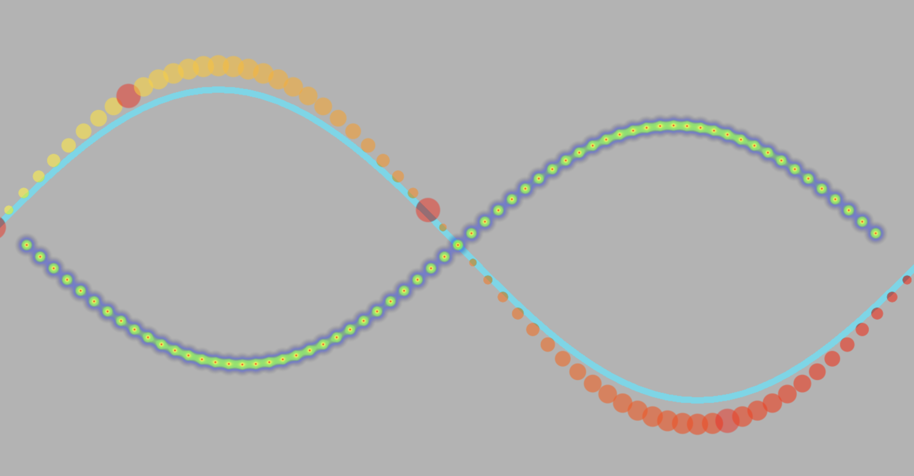

# jad-webgpu-visualization-renderer

A webgpu renderer for data visualization

## Installation

```bash
npm install jad-webgpu-visualization-renderer
```

## Usage

### 散点和轨迹渲染

```ts
import { Renderer, Scene, Points } from 'jad-webgpu-visualization-renderer'
import { PerspectiveCamera } from 'three'

const renderer = new Renderer({ canvas })
const scene = new Scene()
//you can use THREE.PerspectiveCamera or OrthographicCamera
const camera = new PerspectiveCamera(45, canvas.width / canvas.height, 0.1, 1000)
camera.position.set(0, 0, 500)

const num = 40
const pos = new Float32Array(num * 2)
const color = new Uint8Array(num * 4)
const size = new Float32Array(num)
for (let i = 0; i < num; ++i) {
	pos[2 * i] = (640 / num) * i - 320
	pos[2 * i + 1] = Math.sin(((2 * Math.PI) / num) * i) * 100
	color[i * 4 + 0] = 255
	color[i * 4 + 1] = ((num - i) / num) * 255
	color[i * 4 + 2] = 0
	color[i * 4 + 3] = 255
	size[i] = Math.abs(Math.sin(((2 * Math.PI) / num) * i)) * 15 + 15
}

//create Line model
const line = new Line({
	positions: pos,
	material: { color: [0.0, 0.0, 1, 0.5], lineWidth: 10, blending: 'normalBlending' } //optional
})

//create Points model
const points = new Points({
	positions: pos,
	colors: color, //optional
	sizes: size, //optional
	material: {
		//optional
		color: [1, 1, 0, 1],
		blending: 'normalBlending',
		size: 25,
		highlightSize: 40,
		highlightColor: [1, 0, 0, 0.5]
	}
})

scene.addModel(points)
scene.addModel(line)

renderer.render(camera, scene)

setTimeout(() => {
	//change line color after 3sec
	line.material.updateUniform('color', [1, 0, 0, 0.5])
	//highlight 1st 5th 20th and 33th point
	points.highlights([1, 5, 20, 33])
	renderer.render(camera, scene)
}, 3000)
```



### 热力数据渲染

```ts
import { Renderer, Scene, Points } from 'jad-webgpu-visualization-renderer'
import { PerspectiveCamera } from 'three'

const renderer = new Renderer({ canvas })
const scene = new Scene()
//you can use THREE.PerspectiveCamera or OrthographicCamera
const camera = new PerspectiveCamera(45, canvas.width / canvas.height, 0.1, 1000)
camera.position.set(0, 0, 500)

const num = 64
const pos = new Float32Array(num * 2)
const color = new Uint8Array(num * 4)
const size = new Float32Array(num)
for (let i = 0; i < num; ++i) {
	pos[2 * i] = (800 / num) * i - 400
	pos[2 * i + 1] = Math.sin(((2 * Math.PI) / num) * i) * 100
	// pos[2 * i] = (Math.random() * 2 - 1) * 400
	// pos[2 * i + 1] = (Math.random() * 2 - 1) * 200
	color[i * 4 + 0] = 255
	color[i * 4 + 1] = ((num - i) / num) * 255
	color[i * 4 + 2] = 0
	color[i * 4 + 3] = 155
	size[i] = Math.abs(Math.sin(((2 * Math.PI) / num) * i)) * 25 + 10
}

const line = new Line({
	positions: pos.map((p, i) => (i % 2 === 1 ? p * 1.3 : p)),
	material: { color: [0.0, 0.9, 1, 0.7], lineWidth: 10, blending: 'normalBlending' }
})
const points = new Points({
	positions: pos.map((p, i) => (i % 2 === 1 ? p * 1.5 : p)),
	colors: color,
	sizes: size,
	material: {
		color: [1, 1, 0, 0.7],
		blending: 'normalBlending',
		// size: 10,
		highlightSize: 40,
		highlightColor: [1, 0, 0, 0.5]
	}
})
const heat = new Heatmap({
	points: pos.map((p, i) => (i % 2 === 1 ? p * -1 : p * 0.9)),
	material: {
		radius: 40
	}
})
//@ts-ignore
// window.h = heat

scene.addModel(line)
scene.addModel(points)
scene.addModel(heat)

renderer.render(scene, camera)

setTimeout(() => {
	points.highlights([1, 10, 30, 50]) //highlight the 1st, 10th, 30th, 50th points
	renderer.render(scene, camera)
}, 2000)
```



## TODO

-   [x] 测试vertex attribute 是否支持8位或16位长度的数值  
         （支持uint8，sint8，float16等，但受限于js不支持Float16Array并且webgpu要求vertex buffer的arrayStride必须为4的整数倍，所以只能选择uint8x4或者sint8\*4）
-   [x] Model 添加 dispose 方法
-   [x] Model 添加 visible 属性并通过 visible 控制 Model 是否参与渲染
-   [x] Model 添加 renderOrder 属性，控制 Model 的渲染顺序
-   [x] Line Model 支持 line 图元渲染，并支持拖尾特效、按时间播放以及头部顶点
